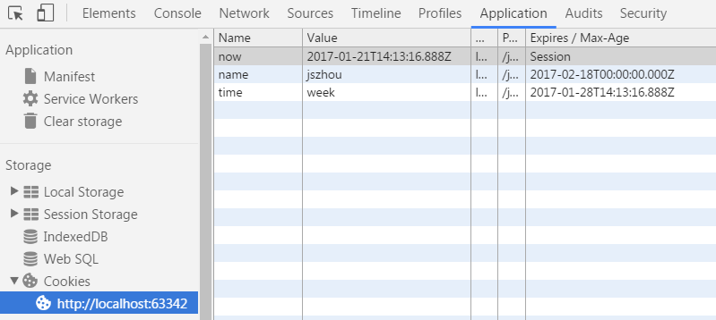

# Document.prototype.cookie

## 标准
[WHATWG: cookie](https://html.spec.whatwg.org/#dom-document-cookie)

## 定义和用法
文档节点的cookie属性用于获取和设置cookie（全称为：HTTP cookie）。cookie是一小块字符串数据，它的存在是为了解决HTTP不能保存状态的问题。cookie既可以在客户端设置也可以在服务器端设置。客服端的HTTP请求每次都会带上对应的cookie，以方便服务器端进行验证。

- 获取cookie
  - 语法：document.cookie
  - 返回值：字符串（DOMString），返回所有的键值对的字符串数据，比如：'name=jszhou; status=active'
  
  
- 设置cookie -- 新增cookie或替换已有cookie
  - 语法：document.cookie = 'key=value[; expires=GMTDate][; domain=domain][; path=path][; secure]'

## 设置cookie的选项
- expires/max-age：用于设置cookie的到期时间。expires和max-age都可以设置到期时间，expires的值是一个GMT格式的时间点，max-age的值是距离现在的秒数。如果都没有设置，则默认为Session，即关闭窗口就过期。
  ```javascript
  document.cookie = 'now=' + new Date().toISOString();
  document.cookie = 'name=jszhou; expires=' + new Date('2017-02-18').toUTCString();

  var weekSecord = 7*24*60*60;
  document.cookie = 'time=week; max-age='+ weekSecord
  ```
  运行结果如下：
  
  
  
- domain：

## 属性描述
cookie 属性可配置，可枚举，可取值，可赋值。

```javascript
// Object.getOwnPropertyDescriptor(Document.prototype, 'cookie') 的结果如下：
var result = {
  configurable: true,
  enumerable: true,
  get: function () { /*[native code]*/ },
  set: function () { /*[native code]*/ }
}
```


## 示例代码


## 参考资料
1. A. Barth. IETF,[HTTP State Management Mechanism](https://tools.ietf.org/html/rfc6265)
2. [MDN: HTTP cookies](https://developer.mozilla.org/en-US/docs/Web/HTTP/Cookies)
2. [MDN: cookie](https://developer.mozilla.org/en-US/docs/Web/API/Document/cookie)
3. [ruoyiqing: 聊一聊 cookie](https://segmentfault.com/a/1190000004556040)
4. [ripple07: 常用的本地存储——cookie篇](https://segmentfault.com/a/1190000004743454)
