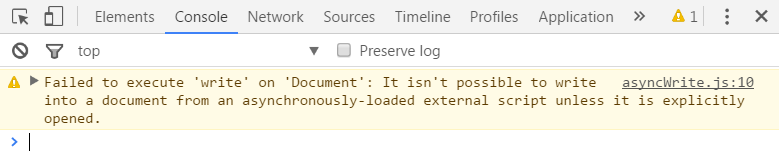

# Document.prototype.write()

## W3C 标准
[WHATWG: write()](https://html.spec.whatwg.org/#dom-document-write)

## 定义和用法
文档节点的write()方法用于写入文档内容，可以传多个参数，写入的字符串会按HTML解析。

- 语法：document.write()
- 参数：字符串，可以传多个字符串参数
- 返回值：undefined

## 注意事项
1. 如果document.write()在DOMContentLoaded或load事件的回调函数中，当文档加载完成，
则会先清空文档（自动调用document.open()），再把字符写入body内容的开头。
2. 在异步引入的js和DOMContentLoaded或load事件的回调函数中运行document.write()，
运行完后，最好手动关闭文档写入（document.close()）。

## 示例代码
在head中运行document.write()，则参数写在body内容的开头。
```html
<!-- 运行前 -->
<head>
    <script>
        document.write('<p>test</p>');
    </script>
</head>
<body>
    <h2>write()</h2>
</body>

<!-- 运行后 -->
<head>
    <script>
        document.write('<p>test</p>');
    </script>
</head>
<body>
    <p>test</p>
    <h2>write()</h2>
</body>
```

在body中运行document.write()，则参数写在运行的script标签后面
```html
<!-- 运行前 -->
<div>
    <script>
        document.write('<p>test</p>');
    </script>
    <p>content</p>
</div>

<!-- 运行后 -->
<div>
    <script>
        document.write('<p>test</p>');
    </script>
    <p>test</p>
    <p>content</p>
</div>
```

同步引用外部js，参数也是写在运行的script标签后面
```javascript
// syncWrite.js
document.write('<p>test</p>');
```
```html
<!-- syncWrite.html -->
<!-- 运行前 -->
<body>
    <script src="syncWrite.js"></script>
    <p>content</p>
</body>

<!-- 运行后 -->
<body>
    <script src="syncWrite.js"></script>
    <p>test</p>
    <p>content</p>
</body>
```

异步引用外部js，必须先运行document.open()清空文档，然后才能运行document.write()，参数写在body内容的开头。
如果不先运行document.open()，直接运行document.write()，则无效且Chrome有如下提示：



```javascript
// asyncWrite.js
document.open();
document.write('<p>test</p>');
document.close();
```
```html
<!-- asyncWrite.html -->
<!-- 运行前 -->
<body>
    <script src="asyncWrite.js" async></script>
</body>

<!-- 运行后 -->
<body>
    <p>test</p>
</body>
```

如果document.write()在DOMContentLoaded或load事件的回调函数中，则不管是在head中，body中，同步的js中，异步的js中，
都会先清空文档（自动调用document.open()），然后运行document.write()，参数写在body内容的开头
```html
<!-- 运行前 -->
<body>
    <script>
        window.addEventListener('load', function () {
            document.write('<p>test</p>');
            document.close();
        }, false);
    </script>
</body>

<!-- 运行后 -->
<body>
    <p>test</p>
</body>
```

document.write()也能写入含有script标签的字符串，但是需要转义。写入的script标签中的内容会正常运行。
```html
<!-- 运行前 -->
<script>
    document.write('<script>document.write("<p>test</p>");<\/script>');
</script>

<!-- 运行后 -->
<script>
    document.write('<script>document.write("<p>test</p>");<\/script>');
</script>
<script>document.write("<p>test</p>");</script>
<p>test</p>
```

document.write()可以传入多个参数。
```html
<!-- 运行前 -->
<body>
    <script>
        document.write('<h2>multiArgument</h2>','<p>test</p>');
    </script>
</body>

<!-- 运行后 -->
<body>
    <script>
        document.write('<h2>multiArgument</h2>','<p>test</p>');
    </script>
    <h2>multiArgument</h2>
    <p>test</p>
</body>
```

## 参考资料
1. https://segmentfault.com/a/1190000006197157
2. http://web.jobbole.com/83288/
3. https://developer.mozilla.org/en-US/docs/Web/API/Document/write
